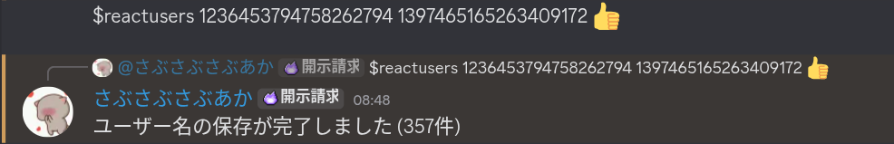

# Discord-Selfbot-UserFetcher

discord.js-selfbot-v13 を使用して  
- 指定サーバーの BOT 以外のユーザーID取得  
- 指定メッセージの特定絵文字リアクションをしたユーザー取得  
を行うツールです

> ⚠️ **注意**  
> Selfbotの利用は Discord 利用規約に違反する可能性があります。  
> アカウント停止などのリスクがありますので、自己責任で使用してください。

---
# プロジェクト構成
```
project/
├── commands/
│ ├── users.js # サーバーユーザーID取得コマンド
│ └── reactusers.js # 任意絵文字リアクションユーザー取得コマンド
├── index.js # メインファイル
├── .env # TOKEN を保存
├── userID.txt # ユーザーID を保存
├── usernames.txt # ユーザー名 を保存
└── package.json
```

## セットアップ

### 1. 必要な環境
- Node.js v18以上
- npm

### 2. インストール
```bash
git clone https://github.com/VEDA00133912/Discord-Selfbot-UserFetcher
cd Discord-Selfbot-UserFetcher
npm install
```

### 3.envファイル作成
```.env
TOKEN=あなたのDiscordトークン
```

### 4.実行
```bash
node index.js
```
起動が成功するとコンソールに
```
Ready! Logged in as 〇〇#0000
```
と表示されます

## コマンド
`$users <serverID>`  
・指定サーバーのBOT以外のユーザーIDを取得し、userID.txt に保存します。  


`$reactusers <channelID> <messageID> <emoji>`  
・指定メッセージに指定絵文字でリアクションした、BOT以外のユーザー名を usernames.txt に保存します。  
・指定は通常絵文字も、カスタム絵文字も可能です。

   
  
> commandsフォルダに追加すれば簡単に機能拡張が可能です  
> コマンドファイルの書き方は今あるやつを参考にしてください
